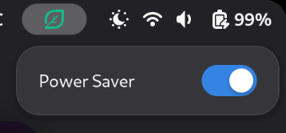
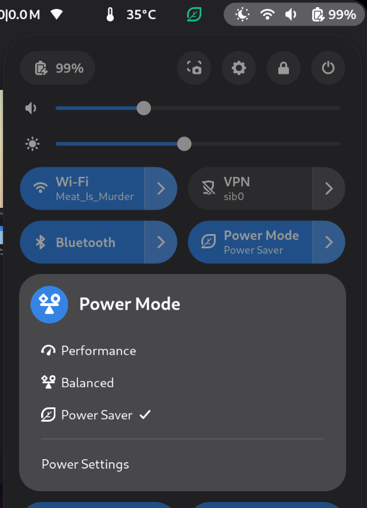

# Cool down your Ryzen AI Max

Depending on your AMD pstate (guided or active), your APU (Ryzen AI Max+ PRO 385/390/395) may have a PPT hovering around 13 ~ 15W or 9 ~ 12W while idle. 

On laptops this induces annoying wamrth in the palmrest and on the lap. 
Switching to the _"Power Saver"_ power profiler won't get you much lower (you may reach 7~8W with `p_state=active`).

## What is does

This extension forces the iGPU to its lower power mode instead of auto and allows the CPU to relax down to 1Ghz instead of the default 2Ghz floor in _"Power Saver"_;

## Results

With this extension **ON** and the following power profile : 
- with "Balanced" you get **4W PPT**.
- with "Power Saver" you get down to **3W PPT**.

When you untoggle the this extension: 
- the iGPU returns to its default `auto` and 
- the CPU floor rises to its defaults `2Ghz`.

## How it does it

- `/sys/devices/system/cpu/cpu*/cpufreq` is forced to 1Ghz or 2Ghz
- `/sys/class/drm/card0/device/power_dpm_force_performance_level` is forced to `low` or `auto` 

## Notes

- The CPU support frequencies down to 625Mhz but there isn't much to gain by going this low, and the scheduler/governor doesn't want to go so low anyways.
- Toggling the extension will prompt you for authentication as it requires root privileges, which is fine if you have a fingerprint reader.
- This could probably work on other AMD APUs but to my knowledge older 780M-based APUs are very well capable to reach 1.5W PPT on their own.
- With the extension enabled, gpt-oss-20B Q4 on Vulkan reaches 15t/s with a PPT of 14W max. This is the same thoughput as a 780M. For reference, the 8060S outputs 55+t/s with the extension off and 70W PPT.
- During testing off the APU I managed to reach 2.5W PPT but cannot recall with which settings/optimization. So there is still a little bit more to shave.
